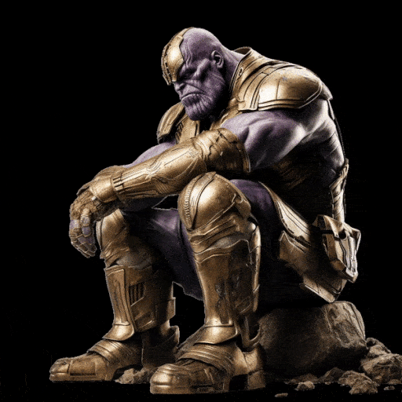

# ChatGPT prompts

I've found the ChatGPT code interpreter feature to be very useful.

I made some prompts for it to turn images into videos and apply some cool animations. You can find the prompts below.

## Avengers Disintegration animation:



Copy and paste the following prompt into ChatGPT. Make sure that you have Code Interpreter enabled.

You also need to upload an image, preferably one with a single subject and a black background.

```
I want to apply the disintegration effect from Avengers to this image. Can you help me with it? Provide me with a link to download the video generated. Use the code below:

import imageio
import numpy as np
import random

# Load the image
image_path = "[INSERT IMAGE PATH HERE]"
image = imageio.imread(image_path)

# Define the block size
block_size = 4

# Get the dimensions of the image
height, width, _ = image.shape

# Make sure the image dimensions are divisible by block size
height -= height % block_size
width -= width % block_size

# Crop the image to the new dimensions
image = image[:height, :width]

# Calculate the number of blocks in each dimension
num_blocks_y, num_blocks_x = height // block_size, width // block_size

# Create an index map of blocks
blocks = np.dstack(np.mgrid[0:num_blocks_y, 0:num_blocks_x]).reshape(-1, 2)

# Multiply the indices by the block size to get the pixel coordinates
blocks *= block_size

# Define the distance to move the blocks (Ask the user for X in percentage, tell user default = 10%)
distance = round(0.1 * width)  # Replace 0.1 with X

# Define the number of times to move each block
move_count = 3

# Create a copy of the original image to work on
working_image = image.copy()

# Convert the blocks to a list and randomly shuffle it
blocks_list = list(map(tuple, blocks))
random.shuffle(blocks_list)

# Define the number of blocks to move (Ask the user for Y in percentage, default = 2% of the total blocks)
num_blocks_to_move = int(0.02 * len(blocks_list))  # Replace 0.02 with Y

# Create a video writer context
with imageio.get_writer('/mnt/data/disintegration_effect.mp4', mode='I', fps=30) as writer:
    # Write a static image to the first 3 frames
    for _ in range(3):
        writer.append_data(working_image)

    # Loop over the blocks in the shuffled list
    for _ in range(move_count):
        for i in range(0, len(blocks_list), num_blocks_to_move):
            # Select a slice of blocks to move
            blocks_to_move = blocks_list[i:i+num_blocks_to_move]

            # For each block, move it to the left by the specified distance
            for block in blocks_to_move:
                y, x = block
                shift_distance = int(min(distance * random.random(), x))  # Don't shift more than the x-coordinate of the block

                if x-shift_distance >= 0:
                    working_image[y:y+block_size, x-shift_distance:x+block_size-shift_distance] = working_image[y:y+block_size, x:x+block_size]
                    working_image[y:y+block_size, x:x+block_size] = 0

            # Write the frame to the video file
            writer.append_data(working_image)
```

Remark: The code above was generated with ChatGPT (with some slight modifications) with the prompt below:

But if you use the prompt below, I found the results to be very inconsistent, with 1/5 success rate. Sometimes it makes lots of mistakes. Therefore, it's better to just provide GPT with the code that it previously generated.

```
Are you familiar with the disintegration effect from Avengers after Thanos snaps his fingers? I want to apply this effect to the PNG image I uploaded. By turning it into a video, can you do it for me?

Using the pixels from the transparent layer, group them into blocks of 4x4 pixels. Then, give each block an index. For each frame, several blocks at random. Then translate those blocks to the left. Keep doing this for the frames until all the blocks have left the image, and only a blank image remains.

Use the imageio library to help you. Save the frames directly to a video file instead of into a list.
```

## Panning an image and turning it into a video


Copy and paste the following prompt into ChatGPT. Make sure that you have Code Interpreter enabled.

You also need to upload an image.

```
This image is a panoramic shot. 

Help me turn it into a video with aspect ratio 3:2, with the image filling the entire video (so the sides are cut off).  The video should be centered in the middle of the image.

Then, pan the video smoothly (with no sudden jumps) as follows:

Start: Center --> Right --> Center --> Left --> Center: End

Use the imageio library to help you. Save the frames directly to a video file instead of into a list.

Use a frame step of 8 pixels. If necessary, crop the edges of the image so that the size of the image is divisible by the frame step.
```
